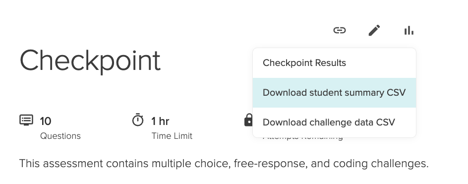

# MCSP Scripts

This repo contains a collection of scripts for automating tasks on the MCSP instructional team.

## Downloading and Installing

You can install these scripts in three steps:

1. `$ git clone [REPO_URL]`
1. `$ cd mcsp-scripts`
1. `$ npm link` - Installs the package, and adds the `mcsp` script as a global binary.

> Note: To ensure the last step worked, you can run `npm list --global` and make sure `mcsp-scripts` is listed in the output. You can also run `npm bin --global` to find the directory where global binaries are installed (default is `~/.npm-global/bin`).

If for any reason you needed to uninstall this package, run `npm uninstall --global mcsp-scripts`.

## Setup

Most commands require access to your cohort's Asana board, to either retrieve student information or to post new subtasks. Because of this, you need to create a PAT. You can do so [here](https://app.asana.com/0/my-apps).

Once you have your PAT, copy `.env.template` to `.env` and assign your PAT to `ASANA_TOKEN` and add your `ASANA_PROJECT_ID` as well. (This can be found in the URL when viewing an Asana board.)

Everything in `.env` can also be passed as an environment variable when running commands, if preferred.

## Commands

### Make Groups

Downloads student info from Asana and prints out students partioned into groups of the given size (or smaller, if the number of students is not divisible by the group size).

`mcsp make-groups [size = 2]`

It takes an `--exclude` option to exclude one or more students from being included in the grouping.

Ex: `mcsp make-groups 3 --exclude="Pam Johnson" --exclude="Marvin Young"`

### Download Students

Downloads student information from Asana and writes it to `data/students.json`.

`mcsp download-students`

### Post Grades

Reads Learn grades file and creates subtasks for each student with grades on their assessments. It will also warn you if anyone scores below a 70%, or if a student has no grade on file for the given assessment.

At the time of writing, there is no programmatic way to pull grades from Learn, but you can get a dump of all student grades by going to `https://learn-2.galvanize.com/cohorts/[COHORT_ID]/custom_reports`, clicking the "Assessment Dashboard" link, scrolling down to the second card, and downloading the json dump to `data/grades.json`.

`mcsp post-grades ASSESSMENT_NAME`

It takes an `--dry-run` option if you want to see what would get posted to Asana before actually posting anything.

Ex: `mcsp post-grades "React" --dry-run`
